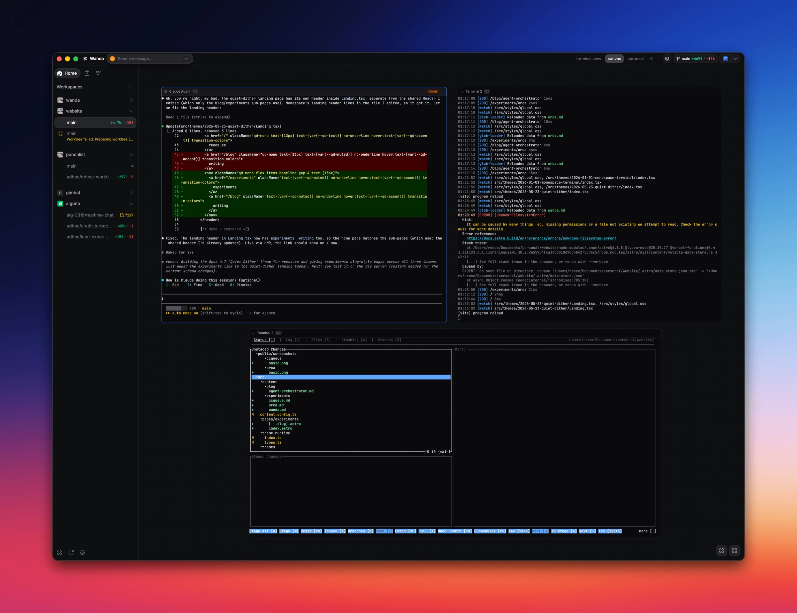

# Wanda

Wanda is an Electron desktop app for managing terminal workspaces. It pairs a fast, multi-pane terminal experience (powered by xterm.js) with a structured backend for organizing your work into pods and workenvs, isolated VM-backed dev stacks tied to individual git worktrees, so you can spin up, attach to, and tear down full development environments without leaving the app.

> **Background:** I wrote up why and how I built Wanda in [the full story and architecture deep-dive](https://reece.so/blog/wanda-agent-orchestrator). There's also a shorter [tech breakdown](https://reece.so/experiments/wanda) covering some of the key decisions.

## Features

- Multi-pane terminal workspaces backed by a shared terminal engine (scrollback, batching, flow control)
- **Workenvs**: one VM per git worktree, each hosting a backend dev stack, managed through a capability-based runtime adapter contract
- Pods that optionally attach to a workenv so their terminals run inside the VM
- Runs as a native desktop app or in the browser against a standalone server
- Type-safe client/server boundary via oRPC contracts and a WebSocket event stream

## Screenshots



## Architecture

Wanda is split across two processes even in desktop mode. The Electron shell owns native concerns; everything else lives in a Wanda server runtime that the renderer always reaches over WebSocket.

```
┌──────────────────────── Electron shell ────────────────────────┐
│  main.ts  - BrowserWindow, tray, native dialogs,                │
│             shell.openExternal, keyboard intercept              │
│  preload  - installs `window.wanda` via WS transport            │
└────────────────┬───────────────────────────────────────────────┘
                 │ HTTP /rpc (oRPC)  +  WS /events
                 │ (both authenticated with Bearer token)
                 ▼
┌──────────────────────── Wanda server runtime ───────────────────┐
│  createServerRuntime()  - SQLite + Effect services +            │
│                            oRPC router + WsGateway              │
│  Runs either EMBEDDED (same process as the shell) or in a       │
│  SUBPROCESS spawned as `out/main/server.js`. Selected via       │
│  WANDA_SERVER_MODE={embedded|subprocess}. Default: embedded.    │
└─────────────────────────────────────────────────────────────────┘
```

The renderer always talks to the server over WebSocket. There is no IPC bridge for RPC calls. Electron IPC is used only for main-process concerns: window lifecycle, keyboard intercepts, tray actions, and `shell.openExternal`. Every type that crosses the client/server boundary lives in `shared/contracts/`.

By default the server runs **embedded** in the same process as the shell; set `WANDA_SERVER_MODE=subprocess` to spawn it as a separate child process from the compiled `out/main/server.js`.

## Tech Stack

Effect · oRPC · Drizzle · TanStack Query/Router · React · xterm.js, running on Electron with SQLite (better-sqlite3) and node-pty.

## Quickstart

Prerequisites: [Bun](https://bun.sh).

```bash
bun install
bun run dev
```

`bun install` builds the native modules (`better-sqlite3`, `node-pty`) against the Electron ABI via the `postinstall` hook. `bun run dev` launches the Electron app with the server embedded and hot reload enabled.

## Scripts

| Script | Description |
|---|---|
| `bun run dev` | Electron dev with the server embedded and hot reload |
| `bun run dev:subprocess` | Electron dev with the server spawned as a child process |
| `bun run build` | Production build: typecheck plus electron-vite build |
| `bun run web:dev` | Vite dev server for the browser build |
| `bun run typecheck` | Run the type checker across `electron`, `src`, and `shared` |
| `bun run lint` | Run Biome and the frontend/backend architecture checks |

## Status

Wanda is published as a public archive. The source is available for reference and reuse under the license below, but the project is not actively accepting issues or pull requests.

Wanda was built primarily between February and April 2026, with follow-up work into May, and prepared as a public archive in June 2026.

## License

Wanda is licensed under the [Apache License 2.0](LICENSE).
